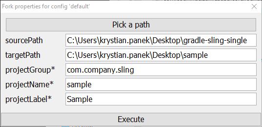

# Sling Single-Project Example

 

  

 

## Description

This project could be used to start developing **application** based on Sling built by **Gradle**.

Documentation for Sling plugin is available in project [Gradle Sling Plugin](https://github.com/Cognifide/gradle-sling-plugin).

## Quickstart

1. Fork this example using command:

    `git clone https://github.com/Cognifide/gradle-sling-single.git && cd gradle-sling-single && gradlew fork`

    

2. Enter forked directory.
3. Specify user specific configuration by running command:

    `gradlew props`

4. Setup local instance and deploy application by running command:

    `gradlew slingSetup`

5. Develop continuously using command:

    `gradlew` (optionally with `-i -S`)
    
6. Reset local instance to initial state by running command (only if needed):

    `gradlew slingResetup -Psling.force`
